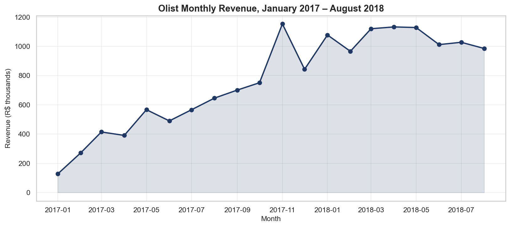
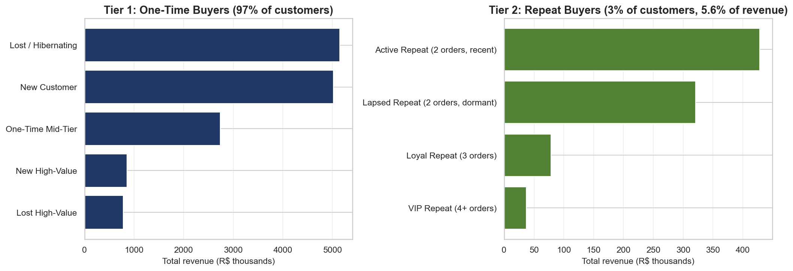
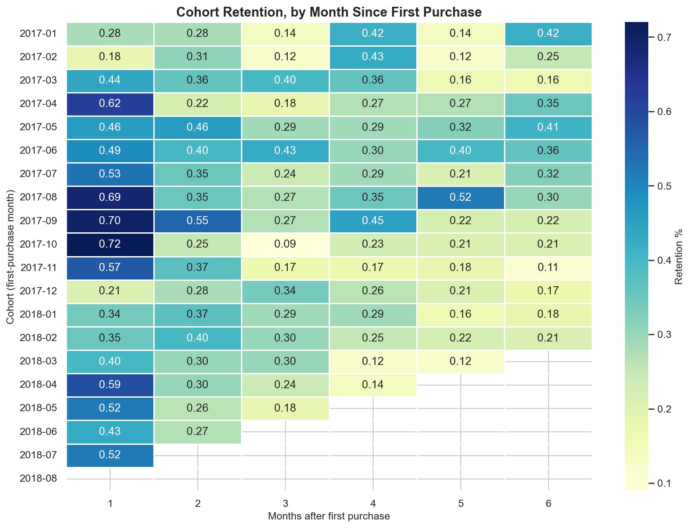
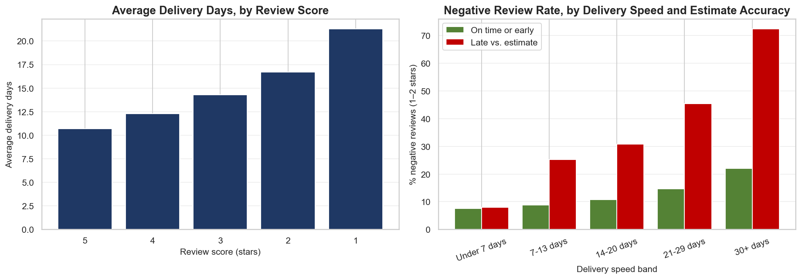

# E-Commerce Customer Analytics

A business analyst portfolio project analyzing approximately 100,000 orders from Olist, a Brazilian e-commerce marketplace operating between 2016 and 2018. The work combines SQL-based investigation across nine relational tables, Python exploratory analysis, and synthesis into operational recommendations.

## Business question

Olist connects small Brazilian sellers with large retail platforms. Over the dataset window the company processed roughly 100,000 orders involving 93,000 unique customers and 3,000 sellers. The project answers four questions that any analyst on Olist's team would face. How is the business growing across time, geography, and product categories. Who are the most valuable customers, and how should they be segmented for retention and growth strategies. What drives customer satisfaction and dissatisfaction, particularly the difference between five-star and one-star reviews. Given these findings, where should the business invest to grow.

## Revenue growth

Olist grew rapidly through 2017 and stabilized in 2018. Monthly revenue climbed from approximately R$125,000 in January 2017 to a peak of R$1.15 million in November 2017, an order-of-magnitude increase in less than a year. Revenue then stabilized in a band between R$1.0 million and R$1.15 million through mid-2018, with a notable single-month dip in December 2017 that likely reflects post-holiday shipping constraints. The truncated final month of October 2018 was excluded from the trend analysis to avoid misleading partial-period comparisons.

## Customer segmentation

A two-tier RFM segmentation revealed a dramatic asymmetry between one-time and repeat customers. The initial application of standard RFM produced misleading labels because Frequency varied almost not at all across the customer base: 97 percent of customers placed exactly one order. The revised approach segments one-time buyers by Recency and Monetary alone, and applies full RFM only to the small population of repeat buyers.

The left panel below shows that one-time buyer segments collectively generate the vast majority of revenue, dominated by the Lost or Hibernating and New Customer groups at over R$5 million each. The right panel shows that repeat buyers, despite being substantially more valuable per person, contribute only 5.6 percent of total revenue because there are so few of them. The Active Repeat segment with two recent orders generates the largest revenue share within Tier 2 at approximately R$420,000, while the VIP Repeat segment with four or more orders contains only 47 customers generating R$37,000 in total revenue.

The strategic implication is that traditional loyalty and retention investment is unlikely to produce meaningful returns at Olist's scale. The repeat-buyer population is too small to materially shift aggregate revenue even if every member were perfectly retained. The higher-leverage opportunity lies in improving the first-purchase experience to drive better acquisition economics and organic word-of-mouth.

## Cohort retention

Cohort retention analysis confirmed and quantified the structural retention problem. The heatmap below shows the percentage of each acquisition cohort that returned to purchase in each subsequent month. Reading horizontally across any row reveals the retention curve for a single cohort; reading vertically down any column reveals how retention has changed across acquisition periods.

Across all observed cohorts from January 2017 onward, month-one retention ranges from 0.18 percent to 0.72 percent, with the strongest cohort being October 2017 at 0.72 percent. Retention falls further in subsequent months, with most cohorts dropping below 0.30 percent by month three. The 2018 cohorts show truncated data because the dataset ends in October 2018, which limits the observable retention window for later acquisition periods. The dominant pattern is uniform near-zero retention regardless of when a customer joined, confirming that Olist's single-purchase behavior is structural rather than cohort-specific.

## Satisfaction and delivery operations

Delivery experience emerged as the dominant driver of customer dissatisfaction. The left panel below shows the unconditional relationship: five-star reviews are associated with an average delivery time of approximately 10.7 days, while one-star reviews are associated with 21.3 days. This monotonic relationship is unsurprising and matches what most analyses of this dataset find.

The right panel reveals a more analytically interesting finding. When delivery is fast in absolute terms, estimate accuracy barely matters: the under-seven-days band shows negative-review rates of approximately seven percent regardless of whether the order arrived on time or late relative to the promised estimate. As delivery becomes slower, the penalty for missing the promised window grows substantially. Within the seven-to-thirteen day band, on-time orders generate about nine percent negative reviews while late orders generate twenty-five percent. The pattern intensifies through the longer bands, culminating in the thirty-plus days range where on-time orders generate twenty percent negative reviews and late orders generate seventy-three percent. The customer experience is therefore governed by the interaction of delivery speed and estimate accuracy, not by either dimension alone. This finding has direct operational implications: deliberately widening delivery estimates for orders going to distant regions or heavy categories would absorb variability that currently translates into negative reviews.

## Strategic recommendations

The findings support three intervention priorities in order of operational tractability. The first priority is seller-quality intervention. Among the active seller base, seventy-eight sellers fall in the Poor or Very Poor quality tiers, accounting for roughly four percent of orders and six percent of revenue. Targeted audit, rehabilitation, or removal of this small group would eliminate approximately five percent of platform-wide negative reviews with minimal operational disruption. The second priority is improving delivery estimate accuracy, particularly for orders shipped to distant states and heavy product categories. The interaction analysis demonstrates that customers tolerate wide promised windows substantially better than missed promises. The third priority is investment in raw delivery speed, which carries the longest implementation horizon because it requires logistics infrastructure changes that the marketplace operator controls only indirectly.

## Methodology

The analytical work is organized into five SQL files, each addressing one analytical question, and one Python notebook that produces visualizations from the SQL outputs. Database setup and data quality validation are in `sql/00_setup.sql` and `sql/01_data_quality.sql`. Customer segmentation using the two-tier RFM model is in `sql/02_rfm_segmentation.sql`. Cohort retention analysis is in `sql/03_cohort_analysis.sql`. Satisfaction and operations diagnostics are in `sql/04_satisfaction_operations.sql`. Dashboard-ready aggregated views are defined in `sql/05_dashboard_views.sql`. The Python notebook at `notebooks/01_exploration.ipynb` produces the four visualizations embedded above.

The RFM segmentation methodology required redesign during the analysis. Initial application of standard RFM produced misleading labels because the dataset's 97 percent one-time-buyer pattern made the Frequency dimension nearly useless: every Champion-labeled customer averaged 1.0 orders. The revised two-tier approach segments one-time buyers by Recency and Monetary alone while applying full RFM only to the small but valuable repeat-buyer population. This methodological decision is documented in the SQL file itself and represents the kind of analytical judgment that distinguishes a thoughtful analysis from a tutorial application.

## Tech stack

PostgreSQL 16 for data storage and analytical queries. Python with pandas, matplotlib, seaborn, and psycopg2 for exploratory analysis and visualization. The analysis uses window functions extensively, including NTILE for percentile-based scoring, LAG for period-over-period comparisons, and FILTER clauses for conditional aggregation. CTEs are used throughout to make multi-stage queries readable.

## Repository structure

The repository organizes the work into clearly separated folders. The `sql` folder contains all analytical queries grouped by business question. The `notebooks` folder contains the Python exploration. The `dashboard` folder contains generated visualizations and pre-aggregated CSV exports. The `writeup` folder contains the detailed findings log with full methodology notes. The `data` folder is structured for the raw Olist dataset, which is not included in the repository because of size constraints; instructions for downloading it are in `data/README.md`.

## Reproducing the analysis

Anyone cloning this repository can reproduce the full analysis by following four steps. Install PostgreSQL 16 and create a database named olist. Download the Olist dataset from the Kaggle link in `data/README.md` and place the CSV files in `data/raw`. Run the five SQL files in order using `psql olist -f sql/00_setup.sql` and so on through `sql/05_dashboard_views.sql`. Open `notebooks/01_exploration.ipynb` in Jupyter or VS Code and run all cells to regenerate the visualizations.

---

Built as part of an active data analytics portfolio. For more work and contact information, see [my GitHub profile](https://github.com/mubinamirzaeva).